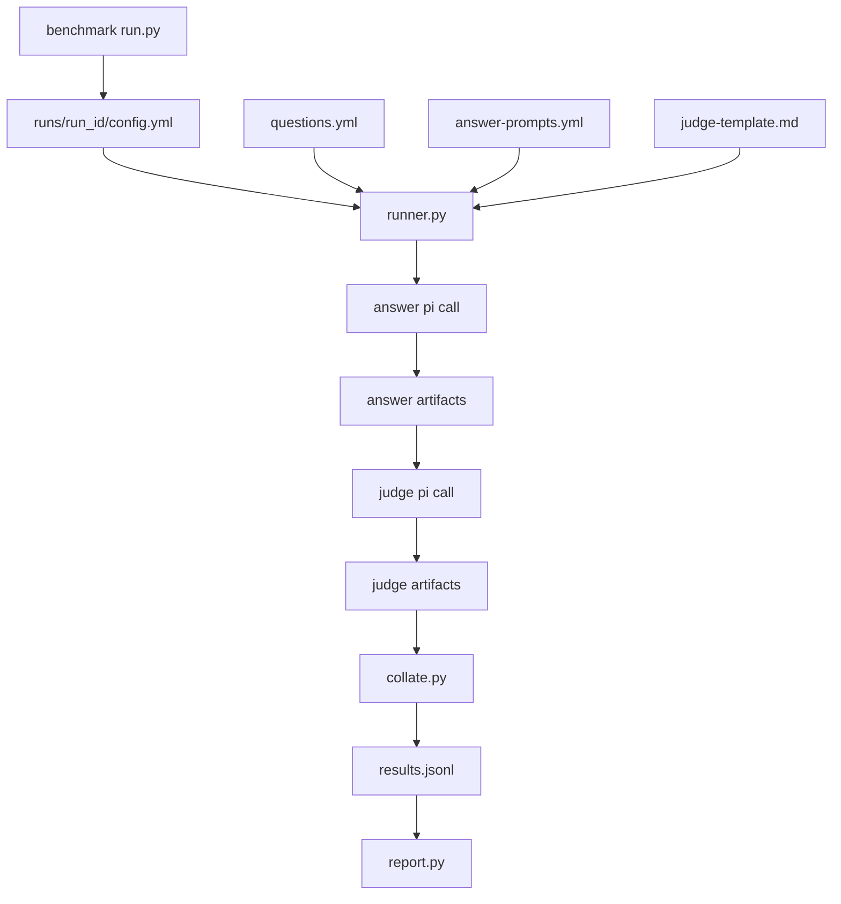

# Architecture

`pi-bench` runs reproducible benchmarks through the real `pi` CLI. A benchmark is defined by case data, prompt variants, model choices, a judge rubric, and parser/reporting code.

The repository currently has one benchmark, `bullshit-detector`, but the root runner and report code are designed around a common shape.

## Main Components

- `bench`: researcher-facing wrapper. It creates or reuses `.venv`, installs dependencies when needed, and dispatches commands through the virtualenv Python.
- `benchmarks/<name>/run.py`: benchmark launcher. It prompts for or accepts CLI arguments, writes `runs/<run-id>/config.yml`, and launches `runner.py`.
- `runner.py`: execution engine. It expands the config matrix, invokes `pi`, stores artifacts, records manifests/results, and triggers report generation.
- `report.py`: report generator. It collates result records into CSV/JSONL/Markdown reports and student-output review files.
- `yaml_loader.py`: small YAML subset loader used by configs and benchmark data files.
- `benchmarks/<name>/collate.py`: benchmark-specific parser that turns judge text into structured result records.

## Data Flow



## Config Contract

Each run has one config at `benchmarks/<name>/runs/<run-id>/config.yml`. Relative paths are resolved from the config directory.

Key fields:

- `benchmark_name`: benchmark id
- `run_id`: concrete run id
- `case_file`: benchmark case data
- `answer_prompt_file`: answer prompt catalog
- `answer_prompts`: selected answer prompt ids
- `models`: answer model entries with `id` and `reasoning`
- `judge`: judge model, judge reasoning mode, and judge template path
- `runner.parser_script`: benchmark parser script

Example:

```yaml
benchmark_name: bullshit-detector
run_id: smoke
case_file: ../../questions.yml
answer_prompt_file: ../../answer-prompts.yml

answer_prompts:
  - baseline-helpful

models:
  - id: plebchat/qwen/qwen3-coder-next
    reasoning: off

judge:
  model: plebchat/google/gemma-4-31b
  reasoning: off
  template_file: ../../judge-template.md

runner:
  parser_script: ../../collate.py
```

## Matrix Expansion

`runner.py` expands:

```text
case x answer model x answer reasoning x answer prompt
```

The judge is not part of the item id. It is run-level configuration recorded in metadata and result records. Changing the judge for an existing run directory can therefore mix judge outputs under the same item ids unless old judge artifacts are cleared or a new run id is used.

## Execution Phases

Runner execution is intentionally phased:

1. Answer phase: run all answer-model calls for runnable items.
2. Judge phase: run judge-model calls for items with answer artifacts and no successful complete record.
3. Parse phase: run parser calls for items with judge artifacts and no successful complete record.

This reduces model swapping on self-hosted inference and keeps recovery after interruption straightforward.

The existing log terminology uses `answer`, `judge`, and `parse`. More formal names are:

- answer: response generation or candidate generation
- judge: rubric grading or model-based evaluation
- parse: score extraction or metric extraction

## Control Principle

`pi-bench` is a controlled benchmarking system. Model inputs should be explicit, reproducible, and preserved in artifacts. See `docs/model-inputs.md` for the detailed input contract.

## Generated Artifacts

Generated run artifacts live under `benchmarks/<name>/runs/<run-id>/`. Do not hand-edit generated artifacts. If a run used incorrect model inputs, prefer a new run id or intentionally clear/recompute the affected artifacts.
